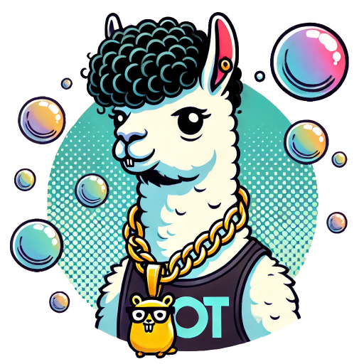

# OllamaTea - BubbleTea Component for Ollama

<p>
    <br>
    <pre>I pity the fool without local terminal inferencing... -OT</pre><br>
    <a href="https://github.com/NimbleMarkets/ollamatea/tags"></a>
    <a href="https://pkg.go.dev/github.com/NimbleMarkets/ollamatea?tab=doc"></a>
    <a href="https://github.com/NimbleMarkets/ollamatea/blob/main/CODE_OF_CONDUCT.md"></a>
</p>

**This is an experimental project.  Interfaces will change and defects are likely.**

[`ollamatea`](https://www.github.com/NimbleMarkets/ollamatea) is a [Bubble Tea](https://github.com/charmbracelet/bubbletea) Component for integrating terminal experiences with an [Ollama LLM server](https://ollama.com).  It offers a base `ollamaTea.Session` component, a simple out-of-the-box `OllamaSessionChat` TUI widget, and some example [tools](#tools) which explore them.

You must have access to an Ollama server to use these tools.  [Follow their instructions](https://ollama.com/download) to install a service locally.

To import the `ollamatea` library, use this Go module statement:
```go
import (
    "github.com/NimbleMarkets/ollamatea"
)
```

To install OllamaTea's various [`ot-` tools](#tools):

 * Download them from the [`ollamatea` releases page](https://github.com/NimbleMarkets/ollamatea/releases)
 * Or install with [Homebrew](https://brew.sh): `brew install NimbleMarkets/homebrew-tap/dbn-go`

## Table of Contents

 * [Components](#components)
   * [`ollamatea.Session`](#ollamatea-session)
   * [`ollamatea.Chat`](#ollamatea-chat)
 * [Configuration](#configuration)
 * [Tools](#tools)
   * [`ot-ansi-to-image`](#ot-ansi-to-image)
   * [`ot-png-prompt`](#ot-png-prompt)
   * [`ot-simplegen`](#ot-simplegen)
   * [`ot-timechart`](#ot-timechart)
 * [Open Collaboration](#open-collaboration) 
 * [Acknowledgements](#acknowledgements)
 * [License](#license)

## Components

### `ollamatea.Session`

The main OllamaTea component is `ollamatea.Session`, which exposes the [Ollama API](https://github.com/ollama/ollama/blob/main/docs/api.md) using the BubbleTea framework.  The `ollamatea.Session` struct holds Ollama session data for generating completions, such as its host and prompt, and handles server responses.   Each `ollamatea.Session` corresponds to the idea of an `ollama run` session.

 `ollamatea.Session` implements the [BubbleTea `Model` interface](https://pkg.go.dev/github.com/charmbracelet/bubbletea#Model) and exposes it via the [BubbleTea Command system](https://github.com/charmbracelet/bubbletea/tree/master/tutorials/commands).   Note that a [BubbleTea Model](https://github.com/charmbracelet/bubbletea?tab=readme-ov-file#the-model) is unrelated to an [Ollama LLM model](https://ollama.com/library).  `ollamatea.Session` implements a BubbleTea `tea.Model`, while `ollamatea.Session.Model` holds the Ollama model name for generation.

One uses `ollamatea.Session` as any other BubbleTea component.  Add it to your model and connect it with your model's `Init/Update/View` methods.  To spawn a generation request, send it `ollamatea.StartGenerateMsg`; to stop the current request, send it a `ollamatea.StopGenerateMsg`.  Currently, only one generation is managed per `ollamatea.Session`; a new `StartGenerateMsg` will cancel the current request. The streaming responses will be sent via `GenerateResponseMsg`, which builds the `Response()` data.  Parent models may also intercept and process this message.  Once the generation is completed, a `GenerateDoneMsg` is sent.

It is critical to properly initialize `ollamatea.Session`.  In a parent model's `Init` method, the session's `Init` call must also be invoked and its resultant command dispatched:

```golang
type model {
    session *ollamatea.Session
}

type (m model) Init() tea.Cmd {
  cmd := m.session.Init()
  return sessionCmd
}
```

Also note that `ollamatea.Session` methods take pointer receivers, rather than value receivers.  This is a little different than most BubbleTea components, but eases internal state management.

To see an example of using `ollamatea.Session`, see [the implementation](./ollamatea_chat.go) of the `ollamatea.ChatPanelModel` component described in the next session.

### `ollamatea.ChatPanelModel`

`ollamatea.ChatPanelModel` is a simple BubbleTea TUI component using `ollamatea.Session`.  It presents a [TextArea](https://github.com/charmbracelet/bubbles?tab=readme-ov-file#text-area) for prompt input and [Viewport](https://github.com/charmbracelet/bubbles?tab=readme-ov-file#text-area) for generation output.

The [`ot-simplegen` tool](#ot-simplegen) is a [minimal example](./cmd/ot-simplegen/main.go) using this component.

*TODO: `ollamatea.ChatPanelModel` features are currently in flux -- the hope is to add a bit more to make it a minimal, but very useful component*

## Configuration

The OllamaTea component defaults can be controlled with [environment variables](./config.go#L20):

| Variable  | Default | Description  |
|---------------------- |---------|------------- |
| `OLLAMATEA_NOENV`     | `""` | If `true`, `yes`, or `1`, then defaults are **not** loaded from the environment. |
| `OLLAMATEA_HOST`     | `"http://localhost:11434"` | The default Ollama server URL. |
| `OLLAMATEA_MODEL`    | `"llama3.2-vision:11b"` | The default Ollama model name. |
| `OLLAMATEA_PROMPT`   | `""` | The default Ollama prompt. |
| `OLLAMATEA_SYSTEM`   | `""` | The default Ollama system prompt. |

## Tools

To exercise the library, there a some CLI tools:

### `ot-ansi-to-image`

`ot-ansi-to-image` converts ANSI-encoded text into a PNG image:

```
$ usage:  ot-ansi-to-png [--help] [--in <ansitext-filename>] --out <png-filename>

Converts input ANSI terminal text from stdin (or a file with --in)
and renders it visually as a PNG image file saved to --out.

If --in is '-' then stdin is used. If --out is '-' then stdout is used.

Example:  $ echo -e "\033[31mHello\033[0m World" | ot-ansi-to-png --out hello.png

      --help         show help
  -i, --in string    Input text filename (default: stdin)
  -o, --out string   Output PNG filename ('-' is stdout)
```

### `ot-png-prompt`

`ot-png-prompt` generates an Ollama response from a PNG image and prompt:

```
usage:  ot-png-prompt [--help] [options] --in <input-png-filename>

Generates an Ollama response from a given PNG image.

The prompt may be specified with  --prompt or the OLLAMATEA_PROMPT envvar.
The default prompt is:
  Describe this image for a visually impaired person'.

Example:  $ ot-png-prompt --in hello.png -m llava

      --help            show help
  -h, --host string     Host for Ollama (also OLLAMATEA_HOST env) (default "http://localhost:11434")
  -i, --in string       Input PNG filename ('-' is stdin)
  -m, --model string    Model for Ollama (also OLLAMATEA_MODEL env) (default "llava")
  -o, --out string      Output PNG filename
  -p, --prompt string   Prompt for Ollama (see --help for default)
  -v, --verbose         verbose output
```

For example, here it describes [this Hellow World image](./tests/hello.png):

```
$ ./bin/ot-png-prompt -i tests/hello.png
The image displays a simple text message in the top-left corner, with the words "Hello World" written in red and white. The background of the image is solid black.

*   In the top-left corner, there are two lines of text:
    *   The first line reads "Hello" in red.
    *   The second line reads "World" in white.
*   The background of the image is a solid black color.


$ ./bin/ot-png-prompt -i tests/hello.png -v --prompt "make a poem about this image"
INFO: ohost=http://localhost:11434 omodel=llama3.2-vision:11b oprompt="make a poem about this image"
In pixelated simplicity, a sight to see,
A message whispers "Hello" from the digital tree.
A single line of code, a world apart,
A greeting in the void, a gentle start.

The screen glows dimly, a pale blue hue,
A canvas waiting for the stories anew.
But for now, it's just a simple phrase,
A hello to the world, in digital daze.
```

### `ot-simplegen`

`ot-simplegen` is a simple chat generation example using little more than the `ollamatea.ChatPanelModel` BubbleTea component.

### `ot-timechart`

`ot-timechart` reads `time,value` data from a CSV file, displays it in as [ntchart `timeserieslinechart`](https://github.com/NimbleMarkets/ntcharts/tree/main/examples#time-series), renders that to a PNG image, and then feeds that to Ollama with a prompt.

Of course, one might feed the chart data directly to Ollama, or perhaps render images it with higher fidelity (e.g. headless HTML charting to images).  But abstractly this workflow could work with any ANSI text display or BubbleTea component `View()`.  It might be an interesting avenue to explore for some interfaces.

This expands on some of the ideas in this [`ntcharts` accessibility issue](https://github.com/NimbleMarkets/ntcharts/issues/2).

```
usage:  ./bin/ot-timechart [--help] [options] --in <input-csv-filename>

A mini-TUI for generating an Ollama response from a simple CSV file.
The CSV file should have a header row with the first column being the time.

The prompt may be specified with  --prompt or the OLLAMATEA_PROMPT envvar.
The default prompt is:
  Describe this image for a visually impaired person'.

See https://github.com/NimbleMarkets/ollamatea/tree/main/cmd/ot-timechart

      --braille         use braille lines (default: arc lines)
      --help            show help
  -h, --host string     Host for Ollama (also OLLAMATEA_HOST env) (default "http://localhost:11434")
  -i, --in string       Input CSV filename ('-' is stdin)
  -m, --model string    Model for Ollama (also OLLAMATEA_MODEL env) (default "llama3.2-vision:11b")
  -p, --prompt string   Prompt for Ollama (see --help for default)
  -v, --verbose         verbose output
  -z, --zstd            Input is ZSTD compressed (otherwise uses filename ending in .zst or zstd)
```

## Open Collaboration

We welcome contributions and feedback.  Please adhere to our [Code of Conduct](./CODE_OF_CONDUCT.md) when engaging our community.

 * [GitHub Issues](https://github.com/NimbleMarkets/ollamatea/issues)
 * [GitHub Pull Requests](https://github.com/NimbleMarkets/ollamatea/pulls)

## Acknowledgements

Thanks to to [Charm.sh](https://charm.sh) for making the command line glamorous and sharing [Bubble Tea](https://github.com/charmbracelet/bubbletea), [`go-ansi-to-image`](https://github.com/pavelpatrin/go-ansi-to-image) for the image heavy lifting, and to [Ollama](https://ollama.com) for the inferencing.

## License

Released under the [MIT License](https://en.wikipedia.org/wiki/MIT_License), see [LICENSE.txt](./LICENSE.txt).  Authored by [Evan Wies](https://github.com/neomantra/).

Copyright (c) 2024 [Neomantra Corp](https://www.neomantra.com).   

----
Made with :heart: and :fire: by the team behind [Nimble.Markets](https://nimble.markets).
