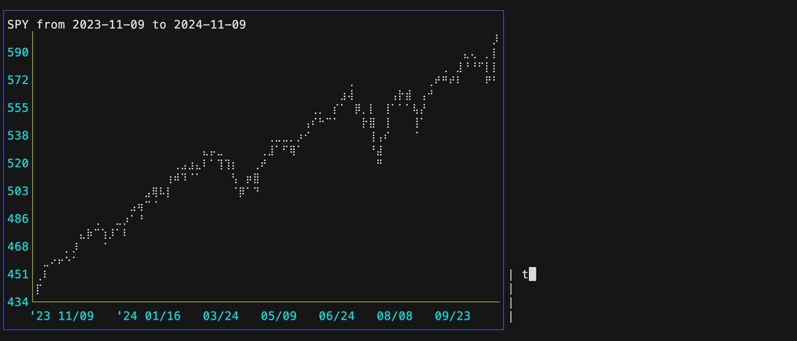

# ot-timechart

`ot-timechart` reads `time,value` data from a CSV file, displays it in as [ntchart `timeserieslinechart`](https://github.com/NimbleMarkets/ntcharts/tree/main/examples#time-series), renders that to a PNG image, and then feeds that to Ollama with a prompt.

Of course, one might feed the chart data directly to Ollama, or perhaps render images it with higher fidelity (e.g. headless HTML charting to images).  But abstractly this workflow could work with any ANSI text display or BubbleTea component `View()`.  It might be an interesting avenue to explore for some interfaces.

This work expands on some of the ideas in this [`ntcharts` accessibility issue](https://github.com/NimbleMarkets/ntcharts/issues/2).  You can see an example with market data on the [`ot-timechart` README](./cmd/ot-timechart/README.md).

```
usage:  ./bin/ot-timechart [--help] [options] --in <input-csv-filename>

A mini-TUI for generating an Ollama response from a simple CSV file.
The CSV file should have a header row with the first column being the time.

The prompt may be specified with  --prompt or the OLLAMATEA_PROMPT envvar.
The default prompt is:
  Describe this image for a visually impaired person'.

See https://github.com/NimbleMarkets/ollamatea/tree/main/cmd/ot-timechart

      --braille         use braille lines (default: arc lines)
      --help            show help
  -h, --host string     Host for Ollama (also OLLAMATEA_HOST env) (default "http://localhost:11434")
  -i, --in string       Input CSV filename ('-' is stdin)
  -m, --model string    Model for Ollama (also OLLAMATEA_MODEL env) (default "llama3.2-vision:11b")
  -p, --prompt string   Prompt for Ollama (see --help for default)
  -v, --verbose         verbose output
  -z, --zstd            Input is ZSTD compressed (otherwise uses filename ending in .zst or zstd)
```

# DataBento Data Example



`ot-timechart` plots a CSV file using [our `ntcharts` Terminal Charting library](https://github.com/NimbleMarkets/ntcharts) and performs an inference of it.

We test this quick by piping an `echo` of the CSV to `ot-timechart` via `stidin`, and using `--in` with the special filename `-`:

```
$ echo "date,num\n2024-01-01,1\n2024-02-01,2\n2024-03-01,4\n2024-04-01,8\n2024-05-01,16\n" | ot-timechart --in -
```

The CSV file should have a header row with the first column being the time.  The repo includes a sample CSV file `tests/SPY.dbeq_basic.20241109.csv.zstd`.  That is a zstd-compressed CSV file of daily SPY stock data for the past year, with data sourced from Databento Basic via this `dbn-hist-go` command.  You can learn more about DataBento and our [`dbn-go` project here](https://github.com/NimbleMarkets/dbn-go).

```
dbn-go-hist get-range  -d DBEQ.BASIC -s ohlcv-1d -t 20231109 -e 20241109 --encoding csv --sout id  -o SPY.dbeq_basic.20241109.csv SPY
```

Using that command incurs some minor cost (pennies); one can modify the query and generate larger costs, so caveat emptor.  This project and `dbn-go` are not affiliated with DataBento.

We can extract that and pass it to `ot-timechart`:

```
$ zstdcat tests/SPY.dbeq_basic.20241109.csv.zstd | gawk -F , '{$1; $8=$8/1000000000} {print $1","$8 }' > tests/SPY.2024.1109.cut.csv.zstd

$ ot-timechart --in  --in tests/SPY.2024.1109.cut.csv.zstd --title "SPY from 2023-11-09 to 2024-11-09" --braille
```
